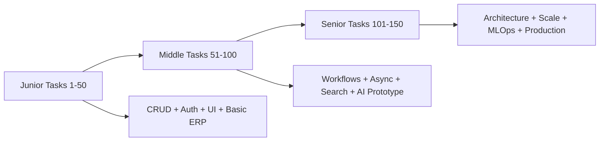
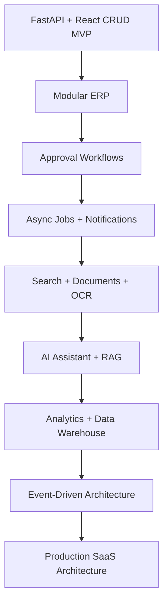
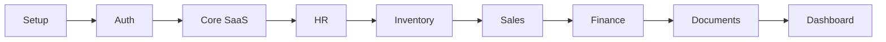
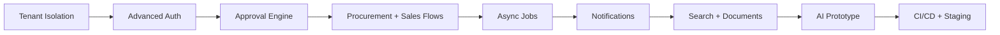
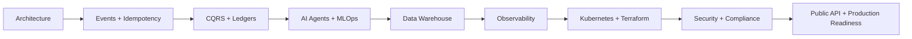
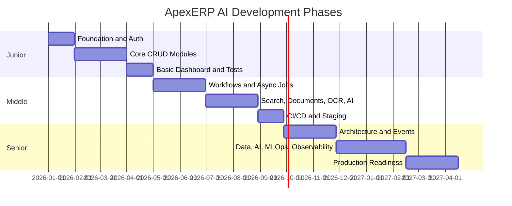

# ApexERP AI — 150-Task Build Roadmap

This roadmap splits the project into **50 junior**, **50 middle**, and **50 senior** tasks.

Main assumption:

- Backend: **FastAPI**
- Frontend: **React + TypeScript**
- Main database: **PostgreSQL**
- Cache/queues: **Redis + Celery**
- Search: **Elasticsearch**
- Analytics: **ClickHouse**
- AI: **LLM APIs, embeddings, RAG, AI agents**
- DevOps: **Docker, Kubernetes, CI/CD, observability**

Each task describes:

- What to build
- Tools to use
- Best practices
- Business use case

---

## Roadmap Structure

---

## Suggested System Evolution

---

## Junior Level — 50 Tasks

Goal: Build the ERP foundation: FastAPI app, React UI, authentication, CRUD modules, basic dashboards, and clean development workflow.

### Task 1: Project repository and local dev environment

**Build:** Create the monorepo structure with `/backend`, `/frontend`, `/infra`, and `/docs`; configure FastAPI, React, Docker Compose, PostgreSQL, and Redis for local development.

**Tools:** FastAPI, React, Vite, Docker, Docker Compose, PostgreSQL, Redis, Makefile

**Best practices:** Use clear folder boundaries, `.env.example`, typed settings, reproducible startup commands, and README-first documentation.

**Use case:** Any developer can clone the project and run the full ERP locally with one command.

### Task 2: Backend health check and version API

**Build:** Create `/health`, `/ready`, and `/version` endpoints that show API status, DB connectivity, Redis connectivity, and build version.

**Tools:** FastAPI, Pydantic, SQLAlchemy, Redis client

**Best practices:** Separate liveness from readiness, return structured JSON, avoid leaking secrets, and add simple tests.

**Use case:** DevOps can verify whether the ERP API is alive and ready before routing traffic to it.

### Task 3: Frontend shell layout

**Build:** Build the main React application shell with top bar, sidebar, content area, user menu, and placeholder module pages.

**Tools:** React, TypeScript, Vite, React Router, Tailwind CSS or shadcn/ui

**Best practices:** Use route-based layout, reusable navigation config, responsive desktop-first design, and strict TypeScript props.

**Use case:** Users get a professional ERP navigation structure before business features are added.

### Task 4: Database migration baseline

**Build:** Set up SQLAlchemy models and Alembic migrations with a first migration for tenants, users, roles, and permissions.

**Tools:** SQLAlchemy 2.x, Alembic, PostgreSQL

**Best practices:** Use explicit naming conventions, UUID primary keys where appropriate, timestamps, soft-delete planning, and migration review.

**Use case:** The ERP can evolve safely without manual database edits.

### Task 5: Tenant model

**Build:** Create the Tenant and CompanyProfile models with CRUD APIs and a basic admin UI.

**Tools:** FastAPI, PostgreSQL, React forms, TanStack Query

**Best practices:** Validate company names, use tenant status enum, add unique constraints, and keep tenant metadata separate from business data.

**Use case:** A platform admin can create and manage company workspaces.

### Task 6: User registration and login

**Build:** Build email/password registration and login with JWT access and refresh tokens.

**Tools:** FastAPI, Pydantic, passlib/argon2, JWT, React Hook Form

**Best practices:** Hash passwords, use short-lived access tokens, validate inputs, and never return password fields.

**Use case:** Users can securely access their ERP account.

### Task 7: Refresh token flow

**Build:** Implement refresh token rotation, logout, and token revocation table.

**Tools:** FastAPI, PostgreSQL, JWT, Redis optional

**Best practices:** Store token family identifiers, revoke old refresh tokens, detect reuse, and test expired token behavior.

**Use case:** Sessions remain secure even when access tokens expire quickly.

### Task 8: Current user endpoint

**Build:** Create `/me` endpoint and frontend auth context to load current user, tenant, roles, and permissions.

**Tools:** FastAPI dependencies, React Context or Zustand, TanStack Query

**Best practices:** Keep authentication state centralized, handle loading/error states, and avoid storing sensitive data in local state.

**Use case:** The UI can show user-specific menus and profile data.

### Task 9: Role and permission seed data

**Build:** Create seed data for Super Admin, Company Owner, Admin, HR Manager, Accountant, Warehouse Manager, Sales Manager, Employee, and Auditor.

**Tools:** Python scripts, SQLAlchemy, Alembic

**Best practices:** Make seeds idempotent, document permission naming, and avoid hard-coding role IDs.

**Use case:** A fresh development database starts with useful test roles.

### Task 10: RBAC dependency

**Build:** Create reusable FastAPI dependencies for permission checks on protected endpoints.

**Tools:** FastAPI dependencies, SQLAlchemy

**Best practices:** Check tenant scope, centralize authorization logic, and write negative tests for forbidden access.

**Use case:** Only authorized users can access sensitive ERP actions.

### Task 11: Sidebar permission filtering

**Build:** Show/hide React sidebar modules based on permissions from `/me`.

**Tools:** React, TypeScript, route config, Zustand

**Best practices:** Never rely only on frontend security; mirror backend permissions and make routes declarative.

**Use case:** Warehouse users see inventory but not payroll or finance.

### Task 12: User management CRUD

**Build:** Build user list, create user, edit user, deactivate user, and assign roles inside a tenant.

**Tools:** FastAPI, PostgreSQL, React Table, React Hook Form

**Best practices:** Use pagination, search, status filters, audit log hooks, and no hard deletes for users.

**Use case:** Company admins can manage employees who access the ERP.

### Task 13: Department CRUD

**Build:** Create departments with manager assignment and hierarchy-ready parent department field.

**Tools:** FastAPI, PostgreSQL, React forms

**Best practices:** Validate tree relationships, prevent cycles later, and index tenant plus department name.

**Use case:** HR can organize employees by department.

### Task 14: Branch CRUD

**Build:** Create company branches/locations with address and contact information.

**Tools:** FastAPI, PostgreSQL, React

**Best practices:** Use tenant-scoped uniqueness, normalized address fields, and status enums.

**Use case:** Companies can manage multiple offices, warehouses, or stores.

### Task 15: Employee profile basic module

**Build:** Create employee profiles linked to users with job title, department, branch, phone, hire date, and status.

**Tools:** FastAPI, PostgreSQL, React, React Hook Form

**Best practices:** Separate auth user from employee record, validate dates, and protect personal fields with permissions.

**Use case:** HR can maintain a company employee directory.

### Task 16: Employee directory UI

**Build:** Build searchable employee directory with filters by department, branch, and status.

**Tools:** React, TanStack Query, table library, FastAPI pagination

**Best practices:** Server-side pagination, debounced search, stable sort fields, and loading states.

**Use case:** Managers can quickly find employee details.

### Task 17: Product category CRUD

**Build:** Create product categories with parent category support.

**Tools:** FastAPI, PostgreSQL, React

**Best practices:** Use slugs, prevent circular parent relationships, and tenant-scope all category queries.

**Use case:** Warehouse managers can organize product catalogs.

### Task 18: Unit of measure CRUD

**Build:** Create units such as piece, kg, meter, liter, box, and pack.

**Tools:** FastAPI, PostgreSQL, React

**Best practices:** Use immutable codes, validate decimals allowed, and seed common units.

**Use case:** Inventory quantities are recorded consistently.

### Task 19: Product CRUD

**Build:** Build product catalog with SKU, name, category, unit, barcode, description, active status, and image placeholder.

**Tools:** FastAPI, PostgreSQL, React, file upload placeholder

**Best practices:** Enforce unique SKU per tenant, validate barcode, use indexed search fields, and support inactive products.

**Use case:** The company can maintain a clean inventory master list.

### Task 20: Warehouse CRUD

**Build:** Create warehouses with branch, manager, address, and status.

**Tools:** FastAPI, PostgreSQL, React

**Best practices:** Tenant-scope all records, use status enums, and prevent deleting warehouses with stock.

**Use case:** A company can manage central warehouse and branch warehouses.

### Task 21: Initial stock balance

**Build:** Build API and UI for entering initial stock balances per product and warehouse.

**Tools:** FastAPI, PostgreSQL transactions, React forms

**Best practices:** Use stock ledger instead of directly editing balance, validate positive quantities, and log adjustments.

**Use case:** Warehouse can initialize inventory when the ERP starts.

### Task 22: Stock movement ledger

**Build:** Create immutable stock movement records for inbound, outbound, adjustment, and transfer movement types.

**Tools:** PostgreSQL, SQLAlchemy, FastAPI

**Best practices:** Use append-only ledger, database transactions, indexes by product/warehouse/date, and never silently update history.

**Use case:** Every stock change has traceable history.

### Task 23: Inventory balance endpoint

**Build:** Create endpoint to show current stock balance by product and warehouse.

**Tools:** FastAPI, SQLAlchemy, PostgreSQL views or queries

**Best practices:** Compute from ledger initially, cache later, avoid race conditions, and test edge cases.

**Use case:** Warehouse managers can see current stock levels.

### Task 24: Low stock field

**Build:** Add minimum stock level to product-warehouse relationship and show low-stock products.

**Tools:** FastAPI, PostgreSQL, React dashboard card

**Best practices:** Keep thresholds configurable per warehouse, index balance queries, and avoid hard-coded alert rules.

**Use case:** Users can detect items that need reordering.

### Task 25: Supplier CRUD

**Build:** Create supplier profiles with name, tax number, contact person, phone, email, and status.

**Tools:** FastAPI, PostgreSQL, React

**Best practices:** Validate email/phone, tenant-scope unique tax number, and use status instead of deletion.

**Use case:** Procurement can maintain supplier database.

### Task 26: Customer CRUD

**Build:** Create customer profiles with contact details, billing address, tags, and status.

**Tools:** FastAPI, PostgreSQL, React

**Best practices:** Use duplicate detection by phone/email, soft-delete strategy, and audit customer changes.

**Use case:** Sales team can manage customer information.

### Task 27: Lead CRUD

**Build:** Create leads with source, stage, owner, expected value, and next action date.

**Tools:** FastAPI, PostgreSQL, React Kanban starter

**Best practices:** Use controlled stage enum, owner permission checks, and date validation.

**Use case:** Sales users can track potential customers.

### Task 28: Simple CRM pipeline board

**Build:** Build a basic Kanban board for leads by stage.

**Tools:** React, TypeScript, drag-and-drop library, FastAPI

**Best practices:** Persist stage changes with API calls, handle optimistic updates carefully, and validate transitions on backend.

**Use case:** Sales managers can see pipeline health visually.

### Task 29: Quotation CRUD

**Build:** Create quotations with customer, line items, discounts, taxes, status, and total calculation.

**Tools:** FastAPI, PostgreSQL, React forms

**Best practices:** Calculate totals on backend, use decimal types for money, and prevent editing approved documents without versioning.

**Use case:** Sales team can send price offers to customers.

### Task 30: Sales order CRUD

**Build:** Convert approved quotations into sales orders with line items and status tracking.

**Tools:** FastAPI, PostgreSQL transactions, React

**Best practices:** Use transactional conversion, maintain source quotation reference, and validate stock later.

**Use case:** Sales operations can process confirmed customer orders.

### Task 31: Invoice basic model

**Build:** Create invoice model for customer invoices with invoice number, customer, dates, line items, tax, status, and total.

**Tools:** FastAPI, PostgreSQL, React

**Best practices:** Use sequential tenant-scoped invoice numbers, decimal money fields, status machine, and immutable issued invoices.

**Use case:** Finance can issue invoices to customers.

### Task 32: Expense CRUD

**Build:** Create simple company expenses with category, amount, date, payment method, description, and attachment placeholder.

**Tools:** FastAPI, PostgreSQL, React forms

**Best practices:** Validate decimal values, require category, add approval-ready status, and index by date/category.

**Use case:** Accountants can record operational expenses.

### Task 33: Chart of accounts starter

**Build:** Create account categories and basic accounts for assets, liabilities, revenue, expenses, and equity.

**Tools:** PostgreSQL, FastAPI, seed scripts

**Best practices:** Use stable account codes, hierarchical structure, and seed idempotently.

**Use case:** Finance module has accounting structure for future reports.

### Task 34: Document upload basic

**Build:** Build file upload API and UI for general documents with title, module, related entity, and access level.

**Tools:** FastAPI UploadFile, local storage or S3-compatible storage, React

**Best practices:** Validate file size/type, store metadata separately, scan filenames, and avoid public direct access.

**Use case:** Users can attach contracts, invoices, and HR documents.

### Task 35: Document list and preview

**Build:** Create document list page with filters and basic preview/download action.

**Tools:** React, FastAPI, storage service

**Best practices:** Use signed URLs or protected download endpoint, permission checks, and safe content disposition.

**Use case:** Users can find and access documents related to business records.

### Task 36: Audit log foundation

**Build:** Create audit log table and helper for create/update/delete/security actions.

**Tools:** FastAPI middleware/service, PostgreSQL

**Best practices:** Record actor, tenant, action, entity type, entity ID, timestamp, and IP; avoid storing sensitive raw values.

**Use case:** Admins can trace who changed important data.

### Task 37: Basic dashboard KPI cards

**Build:** Build dashboard cards for users, employees, products, low-stock products, customers, and open invoices.

**Tools:** FastAPI aggregate endpoints, React cards

**Best practices:** Use efficient aggregate queries, cache where safe, and handle empty states.

**Use case:** Managers get basic company overview after login.

### Task 38: Sales revenue chart

**Build:** Build monthly sales revenue chart from invoices.

**Tools:** FastAPI, PostgreSQL aggregation, React chart library

**Best practices:** Use date truncation, decimal-safe aggregation, tenant filters, and empty month handling.

**Use case:** Management can see sales trend over time.

### Task 39: Expense chart

**Build:** Build monthly expense chart and category breakdown.

**Tools:** FastAPI, PostgreSQL, React charts

**Best practices:** Use server-side aggregation, date filters, and consistent money formatting.

**Use case:** Accountants can understand where money is spent.

### Task 40: Global search UI placeholder

**Build:** Create search box in top bar and search results page with initial search over products, customers, suppliers, and employees.

**Tools:** FastAPI, PostgreSQL ILIKE or full-text starter, React

**Best practices:** Use debouncing, result grouping, permission filtering, and pagination.

**Use case:** Users can quickly find records across the ERP.

### Task 41: Notification model

**Build:** Create notification table with recipient, title, body, type, read status, and related object.

**Tools:** FastAPI, PostgreSQL, React notification dropdown

**Best practices:** Use status flags, recipient indexes, and mark-read endpoints.

**Use case:** Users receive alerts for approvals, low stock, and tasks.

### Task 42: In-app notification UI

**Build:** Build notification dropdown and notification center page.

**Tools:** React, TanStack Query, FastAPI

**Best practices:** Use unread count endpoint, pagination, optimistic mark-read, and clear empty states.

**Use case:** Users can review system notifications without leaving the dashboard.

### Task 43: Basic settings page

**Build:** Create company settings page for name, logo placeholder, timezone, currency, and date format.

**Tools:** FastAPI, PostgreSQL, React forms

**Best practices:** Validate settings, centralize formatting config, and audit setting changes.

**Use case:** Company owners can configure workspace basics.

### Task 44: API error format

**Build:** Standardize API error responses with error code, message, field errors, and request ID.

**Tools:** FastAPI exception handlers, Pydantic

**Best practices:** Never expose stack traces, use consistent HTTP status codes, and document errors in OpenAPI.

**Use case:** Frontend can show predictable error messages.

### Task 45: Frontend API client

**Build:** Create typed API client layer for React with auth token injection, refresh handling, and standardized errors.

**Tools:** Axios or fetch wrapper, TypeScript, TanStack Query

**Best practices:** Keep API logic outside components, handle 401 refresh safely, and type response DTOs.

**Use case:** Frontend screens can call backend consistently.

### Task 46: Form validation pattern

**Build:** Create reusable form components and validation schema pattern for create/edit pages.

**Tools:** React Hook Form, Zod, TypeScript

**Best practices:** Share validation rules where possible, show field errors, and prevent duplicate submits.

**Use case:** All ERP forms behave consistently.

### Task 47: Table component pattern

**Build:** Create reusable server-driven table with pagination, sorting, filters, and actions.

**Tools:** React, TanStack Table, FastAPI pagination

**Best practices:** Keep query params in URL, use stable column definitions, and make actions permission-aware.

**Use case:** Entity lists are consistent across modules.

### Task 48: Basic test suite

**Build:** Add backend tests for auth, tenants, users, products, and invoices; add frontend smoke tests for main routes.

**Tools:** Pytest, HTTPX, React Testing Library, Vitest

**Best practices:** Use isolated test database, factory fixtures, and CI-friendly commands.

**Use case:** The project gains confidence before adding complex features.

### Task 49: Dockerized development database reset

**Build:** Create scripts for database reset, migrations, seed data, and demo data.

**Tools:** Docker Compose, Alembic, Python scripts

**Best practices:** Make commands explicit, protect production DB, and document reset behavior.

**Use case:** You can quickly rebuild a clean demo environment.

### Task 50: Code quality tooling

**Build:** Add backend and frontend quality tooling: formatting, linting, type checking, pre-commit hooks, and consistent commit scripts.

**Tools:** Ruff, Black optional, MyPy or Pyright, ESLint, Prettier, pre-commit

**Best practices:** Run checks locally and in CI, keep rules strict but practical, and document how to fix common failures.

**Use case:** The project develops professional engineering discipline from the beginning.

---

## Middle Level — 50 Tasks

Goal: Build real business workflows, approval systems, background jobs, imports/exports, notifications, search, documents, OCR, and first AI features.

### Task 51: Tenant isolation middleware

**Build:** Implement robust tenant resolution by subdomain, header, or selected workspace, and enforce tenant filtering in all repositories.

**Tools:** FastAPI middleware, SQLAlchemy, PostgreSQL

**Best practices:** Use tenant-aware repository methods, test cross-tenant access denial, and centralize tenant context.

**Use case:** Data from Company A must never leak to Company B.

### Task 52: Advanced RBAC matrix UI

**Build:** Build UI for assigning permissions to roles with module/action matrix.

**Tools:** React, TypeScript, FastAPI, PostgreSQL

**Best practices:** Use permission groups, audit changes, prevent editing protected system roles incorrectly, and validate on backend.

**Use case:** Admins can customize access rules without code changes.

### Task 53: Invitation flow

**Build:** Create user invitation by email with token, expiration, acceptance page, and role assignment.

**Tools:** FastAPI, PostgreSQL, SendGrid, React

**Best practices:** Use signed random tokens, expiration, single-use logic, and resend support.

**Use case:** Admins can invite employees into the company workspace.

### Task 54: Password reset flow

**Build:** Build secure password reset request, email link, reset page, and token invalidation.

**Tools:** FastAPI, SendGrid, PostgreSQL, React

**Best practices:** Use generic responses, token expiry, rate limiting, and password strength validation.

**Use case:** Users can recover accounts safely.

### Task 55: Two-factor authentication

**Build:** Add TOTP-based 2FA setup, QR generation, backup codes, and login verification.

**Tools:** FastAPI, pyotp, QR generation, React

**Best practices:** Encrypt secrets, hash backup codes, require confirmation, and add recovery flow.

**Use case:** High-privilege users can protect their accounts.

### Task 56: Session management dashboard

**Build:** Build active sessions page with device, IP, last seen, and revoke session action.

**Tools:** FastAPI, PostgreSQL, React

**Best practices:** Track refresh tokens, audit revocations, and protect current session UX.

**Use case:** Users can remove suspicious sessions.

### Task 57: Approval engine foundation

**Build:** Create generic approval request model that supports entity type, status, steps, actors, comments, and audit history.

**Tools:** FastAPI, PostgreSQL, SQLAlchemy

**Best practices:** Use state machine thinking, transactions, immutable history, and permission-aware transitions.

**Use case:** Purchases, expenses, documents, and leave requests can share one approval system.

### Task 58: Purchase request workflow

**Build:** Implement purchase request creation, manager approval, rejection, and comments.

**Tools:** FastAPI, PostgreSQL, React, approval engine

**Best practices:** Use approval steps, status transitions, notifications, and audit logs.

**Use case:** Employees can request purchases and managers can approve them.

### Task 59: Purchase order module

**Build:** Build purchase orders from approved purchase requests with supplier, lines, expected delivery, and status.

**Tools:** FastAPI, PostgreSQL, React

**Best practices:** Use transactional conversion, decimal money fields, version-aware document edits, and supplier validation.

**Use case:** Procurement can create formal orders to suppliers.

### Task 60: Goods receipt workflow

**Build:** Create goods receipt records that increase inventory when delivered items are accepted.

**Tools:** FastAPI, PostgreSQL transactions, inventory ledger

**Best practices:** Use database transactions, prevent over-receipt unless configured, and link to purchase order lines.

**Use case:** Warehouse can receive purchased goods into stock.

### Task 61: Supplier invoice matching

**Build:** Create supplier invoice entry and match it against purchase order and goods receipt.

**Tools:** FastAPI, PostgreSQL, React

**Best practices:** Use three-way matching concept, decimal comparisons, tolerance settings, and audit exceptions.

**Use case:** Finance can verify that invoices match ordered and received goods.

### Task 62: Payment tracking

**Build:** Build payment records for invoices with method, amount, date, reference, and status.

**Tools:** FastAPI, PostgreSQL, React

**Best practices:** Use partial payment support, decimal-safe calculations, and immutable payment history.

**Use case:** Finance can track paid, partially paid, and unpaid invoices.

### Task 63: Sales order stock reservation

**Build:** Reserve stock for sales orders before fulfillment.

**Tools:** FastAPI, PostgreSQL locks, inventory ledger

**Best practices:** Use transactions, row-level locking, avoid overselling, and release reservations on cancellation.

**Use case:** Sales cannot promise unavailable stock.

### Task 64: Sales fulfillment flow

**Build:** Build shipment/fulfillment confirmation that deducts reserved stock.

**Tools:** FastAPI, PostgreSQL, React

**Best practices:** Use idempotent fulfillment commands, inventory ledger entries, and status transitions.

**Use case:** Warehouse can ship sales orders reliably.

### Task 65: Invoice generation from sales order

**Build:** Generate customer invoice from fulfilled or confirmed sales order.

**Tools:** FastAPI, PostgreSQL, React

**Best practices:** Prevent duplicate invoices, preserve source references, and calculate totals on backend.

**Use case:** Finance can bill customers based on real orders.

### Task 66: Leave request module

**Build:** Create leave request workflow with leave type, date range, approver, status, and comments.

**Tools:** FastAPI, PostgreSQL, React

**Best practices:** Validate overlapping requests, use approval engine, and notify approvers.

**Use case:** Employees can request vacation or sick leave.

### Task 67: Attendance import

**Build:** Build CSV import for attendance records with validation preview and error report.

**Tools:** FastAPI UploadFile, Pandas optional, PostgreSQL, React

**Best practices:** Use dry-run validation, row-level errors, transaction per batch, and idempotency key.

**Use case:** HR can import attendance from external systems.

### Task 68: Shift schedule module

**Build:** Create shifts, assign employees, and show weekly schedule calendar.

**Tools:** FastAPI, PostgreSQL, React calendar

**Best practices:** Validate overlapping shifts, timezone handling, and role-based editing.

**Use case:** HR can plan employee work schedules.

### Task 69: Task management module

**Build:** Build projects, tasks, assignees, statuses, comments, and due dates.

**Tools:** FastAPI, PostgreSQL, React Kanban

**Best practices:** Use status transitions, activity logs, notification hooks, and optimistic UI carefully.

**Use case:** Teams can manage internal work inside the ERP.

### Task 70: Task comments and mentions

**Build:** Add comments with @mentions and notification creation.

**Tools:** FastAPI, PostgreSQL, React rich text or textarea

**Best practices:** Sanitize content, resolve mention targets, and avoid notification spam.

**Use case:** Employees can discuss tasks and alert colleagues.

### Task 71: WebSocket notification delivery

**Build:** Deliver new notifications in real time through WebSockets.

**Tools:** FastAPI WebSockets, Redis Pub/Sub, React

**Best practices:** Authenticate WebSocket connections, handle reconnects, and publish tenant/user-specific events.

**Use case:** Users see alerts instantly without refreshing.

### Task 72: Celery background job setup

**Build:** Move email sending, report generation, and long-running imports to background workers.

**Tools:** Celery, Redis/RabbitMQ, FastAPI

**Best practices:** Use task IDs, retries, timeouts, structured logs, and dead-letter handling strategy.

**Use case:** Slow operations do not block API requests.

### Task 73: Email notification service

**Build:** Create templated email notification system for invites, password reset, approvals, and invoices.

**Tools:** SendGrid, Jinja templates, Celery

**Best practices:** Use templates, unsubscribe/rate rules where applicable, retries, and delivery logs.

**Use case:** Users receive important ERP events by email.

### Task 74: Telegram bot notifications

**Build:** Create Telegram bot linking flow and send ERP notifications to Telegram.

**Tools:** Aiogram, FastAPI webhook, PostgreSQL

**Best practices:** Use secure linking tokens, user consent, rate limiting, and audit logs.

**Use case:** Managers can receive approval alerts on Telegram.

### Task 75: File storage abstraction

**Build:** Abstract local/S3-compatible file storage with metadata, protected download, and module ownership.

**Tools:** FastAPI, MinIO or S3, PostgreSQL

**Best practices:** Use storage interface, signed URLs or protected endpoints, file size limits, and virus-scan-ready architecture.

**Use case:** Documents can move from local storage to cloud storage without rewriting modules.

### Task 76: OCR processing pipeline

**Build:** Process uploaded invoices/contracts with OCR and store extracted text.

**Tools:** Celery, OCR library/API, PostgreSQL, Elasticsearch

**Best practices:** Run OCR asynchronously, keep original file, track processing status, and handle OCR failures.

**Use case:** Users can search text inside scanned documents.

### Task 77: Elasticsearch full-text search

**Build:** Index products, customers, suppliers, employees, and documents into Elasticsearch.

**Tools:** Elasticsearch, Celery, FastAPI

**Best practices:** Use async indexing events, permission filtering, index aliases, and reindex commands.

**Use case:** Global search becomes fast and relevant.

### Task 78: Document search page

**Build:** Build document full-text search with filters by module, date, owner, and access level.

**Tools:** React, FastAPI, Elasticsearch

**Best practices:** Use highlighted snippets, pagination, permission checks, and clear empty states.

**Use case:** Users can find contracts and invoices quickly.

### Task 79: RAG document Q&A prototype

**Build:** Allow users to ask questions about uploaded documents using embeddings and retrieval.

**Tools:** Vector DB, embeddings, FastAPI, React chat UI

**Best practices:** Chunk documents, store source references, restrict by permissions, and show citations/source snippets.

**Use case:** A manager can ask, 'What is the payment term in this supplier contract?'

### Task 80: AI assistant chat UI

**Build:** Create floating AI assistant panel with conversation history and module-aware prompts.

**Tools:** React, FastAPI, WebSockets or HTTP streaming

**Best practices:** Support streaming output, loading states, conversation persistence, and clear AI limitations.

**Use case:** Users can ask business questions from any ERP page.

### Task 81: Natural language KPI query

**Build:** Create AI tool that maps safe natural language questions to predefined KPI functions.

**Tools:** FastAPI, LLM function calling/tool calling, PostgreSQL

**Best practices:** Do not allow arbitrary SQL initially, whitelist tools, validate tenant permissions, and log AI tool calls.

**Use case:** User asks, 'Show revenue this month,' and AI calls the revenue KPI endpoint.

### Task 82: Invoice OCR extraction

**Build:** Extract supplier name, invoice number, date, total, and line items from uploaded invoices.

**Tools:** OCR, LLM extraction, Pydantic validation, Celery

**Best practices:** Use schema validation, confidence scores, human review, and source text references.

**Use case:** Accountants save time entering supplier invoices.

### Task 83: Expense approval workflow

**Build:** Add expense submission, approval, rejection, and reimbursement status.

**Tools:** FastAPI, PostgreSQL, React, approval engine

**Best practices:** Validate attachments, amount limits, approval levels, and audit every transition.

**Use case:** Employees can submit expenses and finance can approve them.

### Task 84: Budget module starter

**Build:** Create budgets by department/category/month and compare actual expenses against budget.

**Tools:** FastAPI, PostgreSQL, React charts

**Best practices:** Use fiscal period model, immutable approved budgets, and clear variance calculation.

**Use case:** Management can control spending by department.

### Task 85: Cash flow dashboard

**Build:** Build cash-in/cash-out dashboard from invoices, payments, and expenses.

**Tools:** FastAPI aggregation, PostgreSQL, React charts

**Best practices:** Separate actual and expected cash flow, use date filters, and format money consistently.

**Use case:** Finance can see whether the company has enough cash.

### Task 86: Inventory transfer workflow

**Build:** Create transfer request, source approval, shipment, receiving confirmation, and ledger updates.

**Tools:** FastAPI, PostgreSQL transactions, React

**Best practices:** Use status machine, stock reservation, idempotent confirmation, and audit trail.

**Use case:** Stock can move safely between warehouses.

### Task 87: Stock audit/counting module

**Build:** Build stock count sessions, counted quantity input, variance report, and adjustment approval.

**Tools:** FastAPI, PostgreSQL, React

**Best practices:** Freeze counted scope, require approval for variances, and write adjustments to ledger.

**Use case:** Warehouse can reconcile physical stock with ERP stock.

### Task 88: Barcode support

**Build:** Add barcode field and simple scanner-friendly UI for product lookup and stock actions.

**Tools:** React, FastAPI, PostgreSQL

**Best practices:** Validate unique barcodes, optimize lookup endpoint, and support keyboard scanner input.

**Use case:** Warehouse workers can scan items instead of typing SKUs.

### Task 89: Import/export framework

**Build:** Create generic CSV/XLSX import and export framework for products, customers, suppliers, and employees.

**Tools:** FastAPI, openpyxl or pandas, Celery, React

**Best practices:** Use validation preview, templates, background processing, and downloadable error files.

**Use case:** Admins can migrate company data into ApexERP.

### Task 90: Rate limiting

**Build:** Add rate limiting to login, password reset, AI endpoints, and public webhooks.

**Tools:** Redis, FastAPI middleware

**Best practices:** Use user/IP-based limits, clear error format, and monitoring counters.

**Use case:** The system resists brute force and accidental overload.

### Task 91: API pagination standard

**Build:** Standardize pagination, sorting, filtering, and search query conventions across all list endpoints.

**Tools:** FastAPI, Pydantic, SQLAlchemy

**Best practices:** Use consistent params, max page size, indexed fields, and reusable query utilities.

**Use case:** Frontend tables work consistently for every module.

### Task 92: Optimistic concurrency control

**Build:** Add version fields to critical documents such as invoices, purchase orders, and sales orders.

**Tools:** PostgreSQL, SQLAlchemy, FastAPI

**Best practices:** Reject stale updates, return conflict errors, and handle frontend refresh flow.

**Use case:** Two users cannot silently overwrite each other's changes.

### Task 93: Domain service layer

**Build:** Refactor business logic into service classes/use cases separate from API routes.

**Tools:** FastAPI, Python packages, SQLAlchemy

**Best practices:** Keep routes thin, use dependency injection, write unit tests for services, and avoid fat models.

**Use case:** The codebase becomes maintainable as modules grow.

### Task 94: Repository pattern for core modules

**Build:** Create repository classes for users, products, invoices, and approvals.

**Tools:** SQLAlchemy, Python typing, FastAPI

**Best practices:** Keep query logic centralized, tenant-aware, testable, and explicit about transactions.

**Use case:** Business services no longer repeat database logic.

### Task 95: OpenAPI client generation

**Build:** Generate TypeScript API types/client from FastAPI OpenAPI schema.

**Tools:** FastAPI OpenAPI, openapi-typescript, React

**Best practices:** Automate generation in scripts, avoid manual DTO drift, and review breaking API changes.

**Use case:** Frontend and backend stay type-aligned.

### Task 96: Frontend state architecture

**Build:** Separate server state, UI state, auth state, and form state with clear libraries.

**Tools:** TanStack Query, Zustand, React Hook Form

**Best practices:** Do not duplicate server data in global stores, use query invalidation, and keep components thin.

**Use case:** React frontend remains scalable.

### Task 97: Dashboard drill-down

**Build:** Allow dashboard cards/charts to open filtered list pages when clicked.

**Tools:** React Router, query params, FastAPI filters

**Best practices:** Persist filters in URL, keep date ranges consistent, and avoid hidden state.

**Use case:** Managers can move from KPI summary to exact records.

### Task 98: Scheduled reports

**Build:** Let users schedule recurring reports by email with filters and recipients.

**Tools:** Celery beat, FastAPI, PostgreSQL, SendGrid

**Best practices:** Store schedule definitions, validate recipients, generate reports in background, and log deliveries.

**Use case:** Managers receive weekly sales or inventory reports automatically.

### Task 99: PDF export

**Build:** Generate PDF exports for invoices, purchase orders, quotations, and reports.

**Tools:** WeasyPrint or Playwright, FastAPI, Celery

**Best practices:** Use templates, background generation for heavy reports, stable formatting, and audit downloads.

**Use case:** Companies can send official business documents.

### Task 100: XLSX export

**Build:** Export tables and reports to Excel with formatted headers and totals.

**Tools:** openpyxl, FastAPI, Celery optional

**Best practices:** Respect filters, use streaming/download endpoints, and avoid loading huge exports synchronously.

**Use case:** Accountants can analyze ERP data in Excel.

---

## Senior Level — 50 Tasks

Goal: Move from portfolio CRUD project to enterprise-grade system: architecture, event-driven design, CQRS, reliable payments, AI agents, MLOps, data engineering, observability, Kubernetes, security, and production readiness.

### Task 101: Production-grade modular monolith architecture

**Build:** Define domain module boundaries, dependency rules, application services, repositories, events, and shared kernel for the ERP.

**Tools:** FastAPI, Python packages, SQLAlchemy, architectural docs

**Best practices:** Use clean architecture, dependency direction rules, explicit domain services, and architecture decision records.

**Use case:** The codebase can grow to enterprise scale without becoming a single messy CRUD app.

### Task 102: Multi-tenancy strategy hardening

**Build:** Choose and implement tenant isolation strategy with shared DB/shared schema plus strict tenant filters, or schema-per-tenant abstraction.

**Tools:** PostgreSQL, SQLAlchemy, FastAPI

**Best practices:** Threat-model data leakage, add automated tenant leak tests, use query guards, and document tradeoffs.

**Use case:** Enterprise customers trust that their company data is isolated.

### Task 103: Domain event system

**Build:** Create internal domain event bus for events like InvoiceCreated, StockReserved, PaymentReceived, and EmployeeCreated.

**Tools:** Python events, SQLAlchemy, Celery, PostgreSQL outbox

**Best practices:** Use transactional outbox, idempotent consumers, event versioning, and retry-safe handlers.

**Use case:** Modules communicate without tight coupling.

### Task 104: Transactional outbox pattern

**Build:** Implement outbox table and worker that publishes reliable events after DB commit.

**Tools:** PostgreSQL, Celery, Redis/RabbitMQ

**Best practices:** Write outbox records in the same transaction, process with locks, retry safely, and monitor failures.

**Use case:** Payment and inventory events are not lost when services fail.

### Task 105: Idempotency framework

**Build:** Add idempotency keys for payment callbacks, order creation, stock operations, and external webhooks.

**Tools:** FastAPI middleware, PostgreSQL/Redis

**Best practices:** Store request hash, response status, expiration, and handle concurrent duplicate requests safely.

**Use case:** Repeated API calls do not create duplicate payments or stock movements.

### Task 106: Advanced workflow engine

**Build:** Support configurable workflow definitions with conditions, approver groups, thresholds, delegation, escalation, and SLA timers.

**Tools:** FastAPI, PostgreSQL, Celery beat, React workflow builder

**Best practices:** Use state machines, immutable workflow history, versioned definitions, and simulation tests.

**Use case:** Companies can design custom approval processes without code changes.

### Task 107: CQRS read models

**Build:** Create separate optimized read models for dashboard, inventory balance, approvals inbox, and finance reports.

**Tools:** PostgreSQL materialized views or tables, Celery, domain events

**Best practices:** Keep write models normalized, update read models asynchronously, and rebuild projections when needed.

**Use case:** Complex dashboards remain fast without corrupting domain models.

### Task 108: Inventory concurrency under load

**Build:** Design inventory reservation and fulfillment to handle concurrent sales orders safely.

**Tools:** PostgreSQL row locks, transactions, isolation levels, tests

**Best practices:** Use pessimistic locking where needed, consistent transaction boundaries, and stress tests.

**Use case:** High sales volume does not oversell stock.

### Task 109: Accounting ledger foundation

**Build:** Implement double-entry ledger for finance instead of only invoice/payment CRUD.

**Tools:** PostgreSQL, FastAPI, SQLAlchemy

**Best practices:** Use immutable journal entries, balanced debit/credit validation, period locking, and auditability.

**Use case:** Finance data becomes accounting-grade rather than simple records.

### Task 110: Financial period closing

**Build:** Create month-end close process with period locks, adjustment entries, and close reports.

**Tools:** FastAPI, PostgreSQL, React

**Best practices:** Prevent edits in closed periods, require privileged reopening, and audit all changes.

**Use case:** Accountants can close months reliably.

### Task 111: Payment gateway abstraction

**Build:** Create unified payment interface for Stripe, Click, Payme, and future gateways.

**Tools:** FastAPI, provider adapters, webhook handlers

**Best practices:** Use provider-agnostic payment model, idempotent webhooks, signature verification, and reconciliation logs.

**Use case:** The ERP can support multiple markets and payment providers.

### Task 112: Payment reconciliation engine

**Build:** Match bank/gateway payments with invoices using references, amounts, dates, and fuzzy logic.

**Tools:** FastAPI, PostgreSQL, Celery, AI/heuristics optional

**Best practices:** Use deterministic matching first, confidence scores, human review queue, and audit decisions.

**Use case:** Finance reduces manual payment matching work.

### Task 113: Webhook platform

**Build:** Build tenant-configurable outbound webhooks with event selection, signing secret, retries, and delivery logs.

**Tools:** FastAPI, Celery, PostgreSQL

**Best practices:** Use HMAC signatures, exponential backoff, idempotent delivery IDs, and replay functionality.

**Use case:** External systems can react to ERP events.

### Task 114: API gateway and service extraction plan

**Build:** Introduce API gateway pattern and extract notification or AI module into separate service as proof of architecture.

**Tools:** FastAPI, Nginx, Docker/Kubernetes

**Best practices:** Keep contracts stable, use service auth, define ownership, and avoid premature microservices.

**Use case:** The project demonstrates modular monolith to microservice evolution.

### Task 115: Service discovery and internal auth

**Build:** Implement internal service communication with service tokens and discovery config.

**Tools:** Docker/Kubernetes DNS, JWT service tokens, FastAPI

**Best practices:** Authenticate service calls, rotate secrets, trace requests, and document network boundaries.

**Use case:** Extracted services can communicate securely.

### Task 116: Kafka event streaming

**Build:** Introduce Kafka for high-volume business events and analytics ingestion.

**Tools:** Kafka, FastAPI producers, consumers, ClickHouse sink

**Best practices:** Define topics, schemas, partitions, consumer groups, dead-letter topics, and event versioning.

**Use case:** ERP events can feed real-time analytics and downstream systems.

### Task 117: Redis Streams alternative

**Build:** Implement Redis Streams for lighter event streaming in local/small deployments.

**Tools:** Redis Streams, FastAPI, Celery/consumer workers

**Best practices:** Use consumer groups, pending message handling, idempotent consumers, and retention strategy.

**Use case:** The project supports simpler event streaming without Kafka.

### Task 118: Real-time presence

**Build:** Build real-time online user presence and active module tracking.

**Tools:** FastAPI WebSockets, Redis, React

**Best practices:** Use heartbeat, TTL-based presence, tenant isolation, and graceful disconnect handling.

**Use case:** Managers can see who is online and active.

### Task 119: Internal chat module

**Build:** Create tenant-scoped user-to-user and group chat with message history, read status, and attachments.

**Tools:** FastAPI WebSockets, PostgreSQL, Redis, React

**Best practices:** Use pagination, delivery acknowledgements, access checks, and message retention policy.

**Use case:** ERP users can communicate inside the platform.

### Task 120: Video meeting prototype

**Build:** Add WebRTC-based meeting rooms for support or internal collaboration.

**Tools:** WebRTC, React, FastAPI signaling via WebSockets

**Best practices:** Separate signaling from media, handle NAT limitations, define permissions, and document production SFU need.

**Use case:** Teams can start calls from tasks or projects.

### Task 121: AI tool execution framework

**Build:** Create secure AI tool registry so agents can call approved ERP functions.

**Tools:** FastAPI, LLM tool calling, Pydantic schemas

**Best practices:** Whitelist tools, validate arguments, enforce permissions, log every tool call, and require confirmation for destructive actions.

**Use case:** AI can query data or draft actions without bypassing security.

### Task 122: Multi-agent orchestration

**Build:** Build HR, Finance, Inventory, Sales, and Document agents behind a router agent.

**Tools:** LLM APIs, FastAPI, vector DB, tool registry

**Best practices:** Use routing rules, guardrails, source grounding, memory boundaries, and evaluation cases.

**Use case:** User asks one assistant, and the correct department agent handles the request.

### Task 123: RAG permission model

**Build:** Ensure RAG retrieval respects tenant, role, module, document ACL, and record-level permissions.

**Tools:** Vector DB, PostgreSQL ACLs, FastAPI

**Best practices:** Filter before retrieval or securely during retrieval, never expose unauthorized chunks, and test permission boundaries.

**Use case:** AI cannot answer from documents the user is not allowed to see.

### Task 124: AI evaluation suite

**Build:** Build evaluation datasets for document Q&A, KPI questions, extraction, and agent tool use.

**Tools:** Pytest, custom eval scripts, LLM-as-judge optional

**Best practices:** Use golden answers, regression tests, hallucination checks, and permission-leak tests.

**Use case:** AI quality can be measured instead of guessed.

### Task 125: Recommendation system

**Build:** Recommend reorder quantities, customer next actions, training plans, or supplier alternatives.

**Tools:** Python ML, PostgreSQL, ClickHouse, FastAPI

**Best practices:** Start with rules/baselines, evaluate precision, explain recommendations, and allow user feedback.

**Use case:** The ERP helps users decide what to do next.

### Task 126: Forecasting service

**Build:** Build sales, cash flow, and inventory demand forecasting pipeline.

**Tools:** Python ML libraries, Celery/Airflow, ClickHouse/PostgreSQL

**Best practices:** Use train/test splits, backtesting, model versioning, and confidence intervals.

**Use case:** Management can plan future stock and cash needs.

### Task 127: Anomaly detection

**Build:** Detect unusual expenses, stock movements, payment patterns, and attendance anomalies.

**Tools:** Python ML, ClickHouse, FastAPI alerts

**Best practices:** Use explainable thresholds first, reduce false positives, track feedback, and audit alerts.

**Use case:** The system flags suspicious business activity.

### Task 128: MLOps model registry

**Build:** Create basic model registry for versions, metrics, artifacts, deployment state, and rollback.

**Tools:** MLflow or custom registry, PostgreSQL/S3, FastAPI

**Best practices:** Track data version, model version, metrics, owner, and approval status.

**Use case:** AI/ML features become production-manageable.

### Task 129: Model serving service

**Build:** Serve forecasting/anomaly/recommendation models behind internal APIs.

**Tools:** FastAPI model service, Docker, Kubernetes

**Best practices:** Load models safely, expose health checks, use versioned endpoints, and monitor latency.

**Use case:** ERP modules can consume ML predictions reliably.

### Task 130: Feature store starter

**Build:** Create reusable feature tables for customer, product, supplier, and finance analytics.

**Tools:** PostgreSQL/ClickHouse, Airflow, Python

**Best practices:** Define freshness, ownership, backfill strategy, and feature documentation.

**Use case:** ML models use consistent business features.

### Task 131: Data warehouse design

**Build:** Design analytical schema for sales, finance, inventory, HR, and procurement.

**Tools:** ClickHouse, dbt optional, Airflow

**Best practices:** Use facts/dimensions, slowly changing dimensions where needed, and documented metrics.

**Use case:** BI dashboards become fast and consistent.

### Task 132: ETL/ELT orchestration

**Build:** Build Airflow pipelines to load transactional data into ClickHouse and refresh BI models.

**Tools:** Apache Airflow, PostgreSQL, ClickHouse

**Best practices:** Use incremental loads, retries, data quality checks, and backfill support.

**Use case:** Analytics does not overload the production database.

### Task 133: Stream analytics

**Build:** Ingest ERP events into ClickHouse for near-real-time dashboards.

**Tools:** Kafka/Redis Streams, ClickHouse, consumers

**Best practices:** Use event schemas, deduplication keys, batch inserts, and monitoring.

**Use case:** Management sees operational metrics close to real time.

### Task 134: Metric governance

**Build:** Create central metric definitions for revenue, profit, AOV, inventory turnover, and approval SLA.

**Tools:** Docs, dbt metrics or custom registry, FastAPI

**Best practices:** Define formulas, owners, grain, filters, and test queries.

**Use case:** Everyone uses the same business definitions.

### Task 135: Observability baseline

**Build:** Add structured logs, request IDs, traces, metrics, and error reporting across backend and workers.

**Tools:** OpenTelemetry, Prometheus, Grafana, ELK/Graylog

**Best practices:** Propagate trace IDs, avoid sensitive logs, create dashboards, and set alert thresholds.

**Use case:** Production problems can be diagnosed quickly.

### Task 136: SLO and alerting

**Build:** Define SLOs for API latency, error rate, queue delay, WebSocket delivery, and job success rate.

**Tools:** Prometheus, Grafana Alerting

**Best practices:** Use meaningful thresholds, reduce noisy alerts, and document incident response.

**Use case:** The system has measurable reliability goals.

### Task 137: Load testing

**Build:** Run load tests for login, dashboard, search, inventory reservation, and AI endpoints.

**Tools:** Locust or k6, Docker, Grafana

**Best practices:** Test realistic scenarios, identify bottlenecks, and keep performance baselines in CI or docs.

**Use case:** You can prove the ERP handles real traffic.

### Task 138: Database performance tuning

**Build:** Optimize indexes, query plans, materialized views, and pagination for large tenants.

**Tools:** PostgreSQL EXPLAIN, indexes, pg_stat_statements

**Best practices:** Measure before optimizing, use composite indexes, avoid N+1 queries, and document query limits.

**Use case:** Large companies can use ApexERP without slow screens.

### Task 139: Caching strategy

**Build:** Add cache for permissions, settings, dashboard summaries, and lookup lists.

**Tools:** Redis, FastAPI

**Best practices:** Use explicit TTLs, cache invalidation events, tenant-aware keys, and avoid caching sensitive data incorrectly.

**Use case:** Common pages load faster under load.

### Task 140: Distributed locking

**Build:** Use locks for scheduled jobs, stock operations, report generation, and idempotency race cases.

**Tools:** Redis locks or PostgreSQL advisory locks

**Best practices:** Use timeouts, lock ownership tokens, and avoid long critical sections.

**Use case:** Concurrent workers do not process the same job incorrectly.

### Task 141: Kubernetes deployment

**Build:** Create Kubernetes manifests or Helm chart for API, frontend, workers, Redis, ingress, and config.

**Tools:** Kubernetes, Helm, Docker, Nginx Ingress

**Best practices:** Use probes, resource limits, secrets, config maps, rolling updates, and separate environments.

**Use case:** ApexERP can be deployed like a real SaaS product.

### Task 142: Terraform infrastructure

**Build:** Define cloud infrastructure for network, database, storage, Kubernetes, and secrets.

**Tools:** Terraform, AWS or compatible cloud

**Best practices:** Use modules, remote state, least privilege IAM, and environment separation.

**Use case:** Infrastructure becomes reproducible.

### Task 143: Autoscaling strategy

**Build:** Configure autoscaling for API pods, workers, and possibly model services based on CPU/queue metrics.

**Tools:** Kubernetes HPA/KEDA, Prometheus

**Best practices:** Scale on meaningful metrics, define min/max replicas, and test under load.

**Use case:** The platform handles traffic spikes and background job bursts.

### Task 144: Blue-green or canary deployment

**Build:** Implement safer deployment strategy for backend and frontend releases.

**Tools:** Kubernetes, Nginx/Ingress, CI/CD

**Best practices:** Use health checks, smoke tests, rollback, and migration compatibility rules.

**Use case:** New releases can be shipped with less risk.

### Task 145: Secrets management

**Build:** Move secrets from `.env` to a proper secrets system for staging/production.

**Tools:** Kubernetes Secrets, Vault or cloud secret manager

**Best practices:** Rotate secrets, restrict access, audit usage, and avoid logging secrets.

**Use case:** Production credentials are handled professionally.

### Task 146: Backup and disaster recovery

**Build:** Implement database backups, file storage backups, restore testing, and recovery documentation.

**Tools:** PostgreSQL backup tools, S3, scripts, CI checks

**Best practices:** Test restores, define RPO/RTO, encrypt backups, and monitor backup success.

**Use case:** The company can recover from data loss.

### Task 147: Security hardening

**Build:** Add security headers, CORS rules, CSRF strategy where needed, dependency scanning, and vulnerability checks.

**Tools:** FastAPI middleware, Nginx, Dependabot, Trivy

**Best practices:** Use least privilege, secure defaults, regular scans, and documented threat model.

**Use case:** The ERP is safer for enterprise usage.

### Task 148: Audit and compliance report

**Build:** Build compliance export showing user access, security events, approvals, and sensitive changes.

**Tools:** FastAPI, PostgreSQL, PDF/XLSX export

**Best practices:** Make logs tamper-resistant where possible, filter by date/module, and protect auditor permissions.

**Use case:** Auditors can review company activity.

### Task 149: Data retention and deletion

**Build:** Implement retention policies, soft deletion, anonymization, and tenant offboarding export/delete flow.

**Tools:** FastAPI, PostgreSQL, Celery

**Best practices:** Separate soft delete from legal deletion, document retention rules, and audit deletion requests.

**Use case:** Companies can manage lifecycle of old data.

### Task 150: Public API platform

**Build:** Create external API with API keys, scopes, rate limits, docs, and SDK-ready schemas.

**Tools:** FastAPI, OpenAPI, API keys, Redis

**Best practices:** Use scoped keys, audit usage, version APIs, and provide examples.

**Use case:** Customers can integrate their own systems with ApexERP.

---

## Recommended Order of Implementation

---

## Final Target

After completing all 150 tasks, ApexERP AI should demonstrate:

- Senior-level FastAPI backend engineering
- React enterprise dashboard development
- PostgreSQL transactional modeling
- Redis caching and real-time behavior
- Celery background processing
- Approval workflows and business process modeling
- AI assistant and RAG architecture
- Search and document processing
- Data engineering and BI
- Event-driven architecture
- Cloud deployment and observability
- Security, auditability, and production readiness
