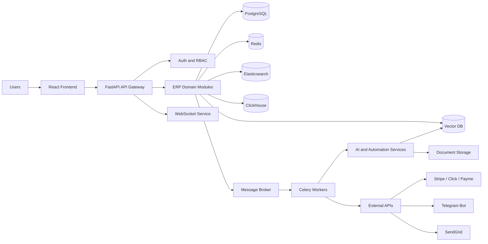
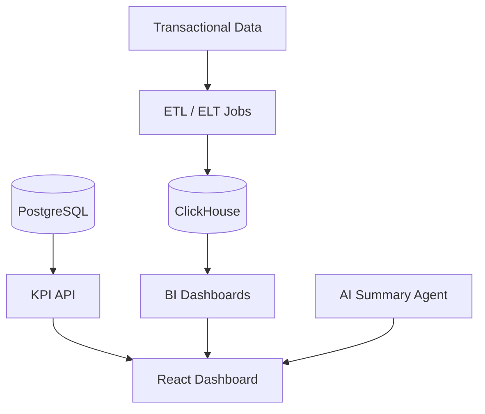
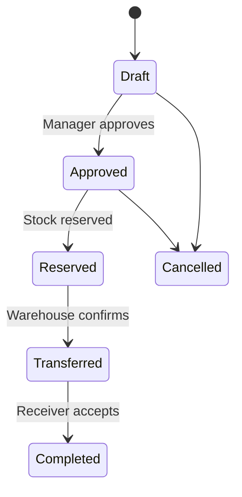
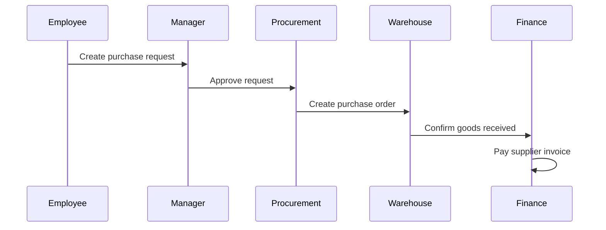
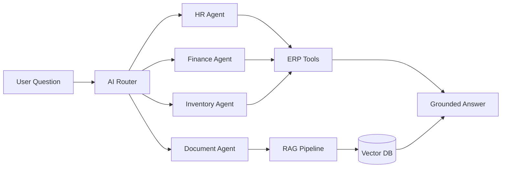
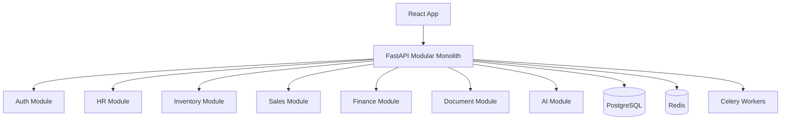

# ApexERP AI — Enterprise AI-Powered ERP System

## 1. Product Vision

**ApexERP AI** is a massive multi-tenant SaaS ERP platform for companies that want to manage operations, employees, inventory, sales, procurement, finance, documents, analytics, and AI-assisted decision-making from one system.

The product should feel like a portfolio-grade enterprise system, similar in scope to:

- Odoo-style modular ERP
- SAP Business One-style business management
- Zoho-style SaaS platform
- AI-native internal operating system for companies

The main backend framework is **FastAPI**. The main frontend framework is **React**.

---

## 2. Core Technology Stack

### Backend

- Python 3.12+
- FastAPI
- Pydantic v2
- SQLAlchemy 2.x
- Alembic
- PostgreSQL
- Redis
- Celery
- RabbitMQ or Redis broker
- JWT authentication
- OAuth2 flows
- WebSockets
- AsyncIO
- OpenAPI documentation

### Frontend

- React
- TypeScript
- Vite
- TanStack Query
- React Router
- Zustand or Redux Toolkit
- React Hook Form
- Zod validation
- Tailwind CSS or shadcn/ui
- Recharts / ECharts
- WebSocket client

### Data and Search

- PostgreSQL for transactional data
- Redis for cache, locks, sessions, and real-time state
- Elasticsearch for full-text search
- ClickHouse for analytics events and BI
- Vector database for document embeddings and RAG

### AI and Automation

- LLM API integration
- RAG pipeline
- Embeddings
- OCR
- AI agents by department
- Recommendation systems
- Anomaly detection
- Report generation
- Evaluation datasets for AI quality

### DevOps and Observability

- Docker
- Docker Compose
- Kubernetes
- Helm
- Nginx
- GitHub Actions or GitLab CI
- Prometheus
- Grafana
- OpenTelemetry
- ELK / Graylog
- Sentry-style error tracking

---

## 3. High-Level System Architecture



---

## 4. Application Layout

The UI should use a professional SaaS dashboard layout.

```text
┌───────────────────────────────────────────────────────────────┐
│ Top Bar: Global Search | AI Assistant | Notifications | User   │
├───────────────────┬───────────────────────────────────────────┤
│ Sidebar           │ Main Workspace                            │
│                   │                                           │
│ Dashboard         │ KPI cards                                 │
│ HR                │ Data tables                               │
│ Inventory         │ Forms                                     │
│ Procurement       │ Charts                                    │
│ Sales & CRM       │ Kanban boards                             │
│ Finance           │ Approval timelines                        │
│ Documents         │ AI assistant side panel                   │
│ Reports           │                                           │
│ Settings          │                                           │
└───────────────────┴───────────────────────────────────────────┘
```

Primary UI principles:

- Desktop-first enterprise layout
- Role-based navigation
- Fast tables with filters, sorting, pagination, and export
- Clear dashboards with KPI cards
- Inline create/edit modals for simple entities
- Dedicated pages for complex workflows
- Audit trail visible on important records
- Real-time notifications
- AI assistant accessible from all modules

---

## 5. Main Modules

## 5.1 Core SaaS Platform

This is the foundation of the ERP.

### Features

- Multi-tenant company system
- Tenant registration and onboarding
- Company profile
- Branches and departments
- Subscription plans
- Billing state
- User invitations
- Module enable/disable settings
- Activity history
- Audit logs
- API keys
- Tenant isolation

### Main Entities

- Tenant
- CompanyProfile
- Branch
- Department
- User
- Role
- Permission
- Subscription
- AuditLog
- ApiKey

### Example Use Case

A new company signs up, creates its workspace, invites employees, enables HR/Inventory/Finance modules, and starts using ApexERP AI as its internal business platform.

---

## 5.2 Authentication and Security

### Features

- Email/password login
- JWT access and refresh tokens
- OAuth2 login option
- Password reset
- Two-factor authentication
- Session/device tracking
- Role-based access control
- Permission-based API guards
- Department-level access
- IP restrictions
- Security audit trail

### Security Rules

- Never store raw passwords
- Use password hashing with modern algorithms
- Use short-lived access tokens
- Use refresh token rotation
- Validate permissions at API level and UI level
- Log sensitive actions
- Protect tenant boundaries in every query

---

## 5.3 Dashboard and Analytics

### Features

- Revenue overview
- Expense overview
- Profit chart
- Sales performance
- Purchase statistics
- Low stock alerts
- Pending approvals
- HR metrics
- Finance summary
- AI-generated daily business brief

### Example Dashboard Widgets

- Total Revenue
- Monthly Profit
- Open Invoices
- Low Stock Items
- Active Employees
- Pending Purchase Requests
- Overdue Tasks
- New Leads



---

## 5.4 HR and Employee Management

### Features

- Employee profiles
- Departments and positions
- Attendance
- Leave requests
- Shift schedules
- Employee documents
- Contracts
- Onboarding and offboarding
- Performance reviews
- HR analytics

### AI Features

- Generate job descriptions
- Summarize employee performance
- Detect attendance anomalies
- Recommend training
- Draft HR documents

---

## 5.5 Inventory and Warehouse

### Features

- Product catalog
- Product categories
- Units of measure
- Warehouses
- Stock balances
- Stock movements
- Stock transfers
- Inventory adjustment
- Batch/serial tracking
- Barcode/QR support
- Low-stock alerts
- Stock audit

### AI Features

- Demand forecasting
- Reorder suggestions
- Anomaly detection in stock movements
- Slow-moving stock analysis



---

## 5.6 Procurement and Purchasing

### Features

- Supplier management
- Purchase requests
- RFQ system
- Purchase orders
- Goods receipt
- Supplier invoices
- Approval chain
- Payment tracking
- Contract management
- Purchase analytics

### Example Workflow



---

## 5.7 Sales and CRM

### Features

- Customer database
- Lead management
- Deal pipeline
- Quotations
- Sales orders
- Invoices
- Customer communication history
- Sales team performance
- Discount management
- Customer segmentation

### AI Features

- Lead scoring
- Sales forecast
- Churn prediction
- AI-generated customer emails
- Deal summary

---

## 5.8 Finance and Accounting

### Features

- Chart of accounts
- Customer invoices
- Supplier invoices
- Payments
- Expenses
- Revenue tracking
- Profit/loss report
- Cash flow report
- Budget planning
- Payment reconciliation
- Financial approvals

### AI Features

- Invoice OCR
- Expense anomaly detection
- Duplicate invoice detection
- Cash flow forecasting
- Financial report summarization

---

## 5.9 Document Management

### Features

- File upload
- Folder structure
- Access permissions
- Versioning
- Document approval
- OCR text extraction
- Full-text search
- Contract templates
- Company policies
- Certificates

### AI Features

- Document summarization
- Contract risk analysis
- Ask questions from company documents
- Extract structured fields from PDFs/images
- Draft documents from templates

---

## 5.10 Workflow and Approval Engine

### Features

- Custom approval chains
- Request forms
- Status tracking
- Escalation rules
- Notifications
- Approval history
- Reject/return flow
- Delegation support

### Workflow Examples

- Purchase request approval
- Leave request approval
- Expense approval
- Invoice approval
- Contract approval
- Stock adjustment approval

---

## 5.11 Project and Task Management

### Features

- Projects
- Tasks and subtasks
- Kanban board
- Deadlines
- Assignees
- Comments
- Attachments
- Time tracking
- Budget tracking
- Progress reports

### AI Features

- Task breakdown
- Project risk detection
- Progress summary
- Deadline prediction
- Meeting summary

---

## 5.12 Notification and Communication

### Features

- In-app notifications
- Real-time WebSocket notifications
- Email notifications
- Telegram notifications
- Mentions
- Task reminders
- Approval alerts
- Low-stock alerts
- Payment reminders

### Technology

- FastAPI WebSockets
- Redis Pub/Sub or Redis Streams
- Celery background jobs
- Telegram Bot with Aiogram
- SendGrid email

---

## 5.13 AI Assistant and AI Agents

The AI assistant is a cross-module feature available from every page.

### Example Commands

- Show this month’s profit
- Which products are low in stock?
- Summarize pending approvals
- Generate invoice email
- Analyze sales performance
- Find suspicious expenses
- Create a purchase report
- Explain why revenue decreased

### Department Agents

- HR Agent
- Finance Agent
- Sales Agent
- Inventory Agent
- Procurement Agent
- Document Agent
- Analytics Agent
- Support Agent



---

## 5.14 BI and Reporting

### Features

- Custom reports
- Saved reports
- Scheduled reports
- Chart builder
- Export to Excel/PDF
- Department dashboards
- KPI tracking
- Drill-down analytics
- Real-time analytics

### Reports

- Sales report
- Profit/loss report
- Inventory report
- Attendance report
- Purchase report
- Supplier performance report
- Customer performance report
- Expense report

---

## 5.15 Integrations

### Features

- Stripe payment integration
- Click integration
- Payme integration
- Telegram bot
- SendGrid email
- Webhook system
- External API integration
- Import/export API
- Payment reconciliation
- External accounting integration

### Webhook Events

- Payment succeeded
- Invoice created
- Stock low
- New employee added
- Purchase order approved
- Document approved

---

## 5.16 Admin and Settings

### Features

- Company settings
- User settings
- Roles and permissions
- Department setup
- Currency setup
- Language setup
- Tax setup
- Notification settings
- Workflow settings
- API settings
- Security settings
- Backup settings
- System logs

---

## 6. Main User Roles

| Role | Responsibility |
|---|---|
| Super Admin | Manage all tenants and global platform settings |
| Company Owner | Manage company workspace, billing, users, reports |
| Admin | Configure modules, users, roles, settings |
| HR Manager | Manage employees, attendance, leave, HR documents |
| Accountant | Manage invoices, payments, expenses, reports |
| Warehouse Manager | Manage products, stock, warehouses, transfers |
| Sales Manager | Manage customers, leads, orders, CRM pipeline |
| Procurement Manager | Manage suppliers, purchase requests, purchase orders |
| Employee | Create requests, view own tasks, receive notifications |
| Auditor | Read-only access to reports and logs |

---

## 7. Example End-to-End Business Flow

### Purchase Request Flow

```text
1. Employee needs a laptop.
2. Employee creates a purchase request.
3. Department manager reviews and approves it.
4. Procurement sends RFQ to suppliers.
5. Procurement creates purchase order.
6. Supplier delivers laptop.
7. Warehouse confirms goods receipt.
8. Finance receives supplier invoice.
9. Finance approves payment.
10. Asset is assigned to the employee.
11. AI updates reports and generates a summary.
```

This single flow touches:

- Users
- Departments
- Workflow approvals
- Procurement
- Inventory
- Finance
- Documents
- Notifications
- Audit logs
- Analytics
- AI assistant

---

## 8. Suggested Development Strategy

The system should be built as a **modular monolith first**, then gradually split selected modules into services only when needed.

### Recommended First Architecture



Why modular monolith first:

- Easier local development
- Faster feature delivery
- Easier debugging
- Stronger transactional consistency
- Better for one developer or small team
- Can still use clean architecture and domain boundaries

Later, when the project grows, extract heavy areas:

- Notification service
- AI service
- Analytics service
- Search service
- File/document service

---

## 9. Final Product Shape

ApexERP AI should become:

> A professional multi-tenant ERP SaaS platform with role-based access, dashboards, finance, inventory, HR, sales, procurement, documents, workflows, integrations, analytics, and AI agents.

In one sentence:

> ApexERP AI is one platform where a company manages its people, money, stock, sales, purchases, documents, reports, and AI-assisted decisions.
